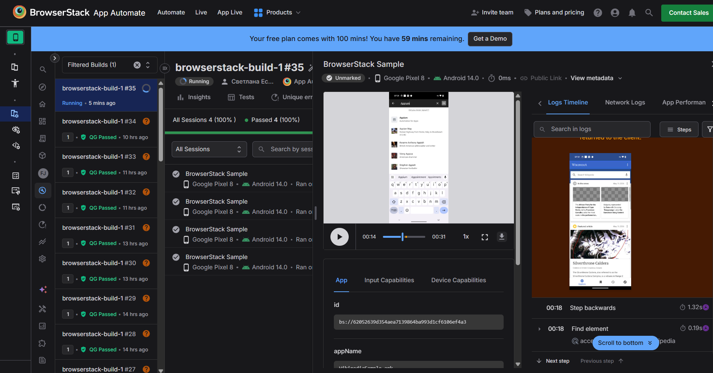
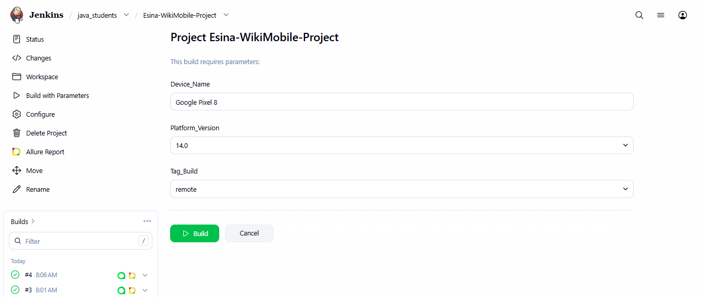
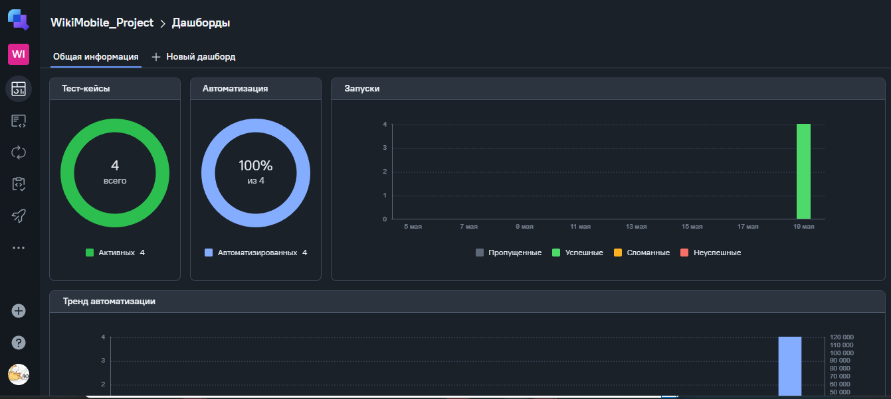
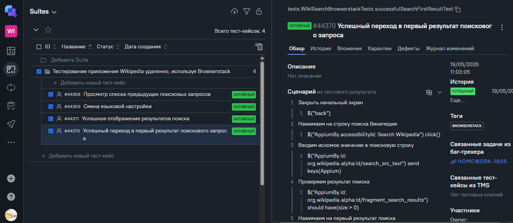
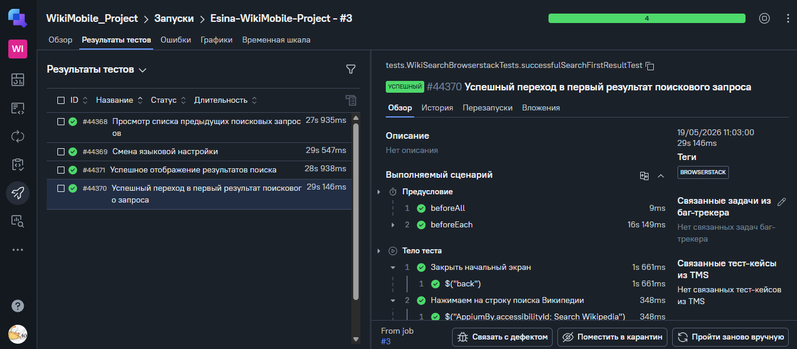
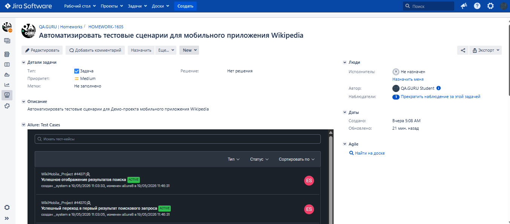
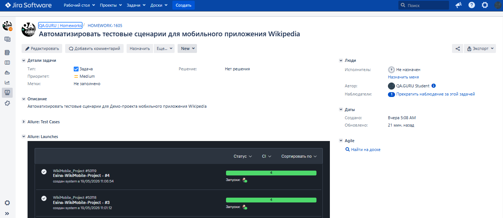
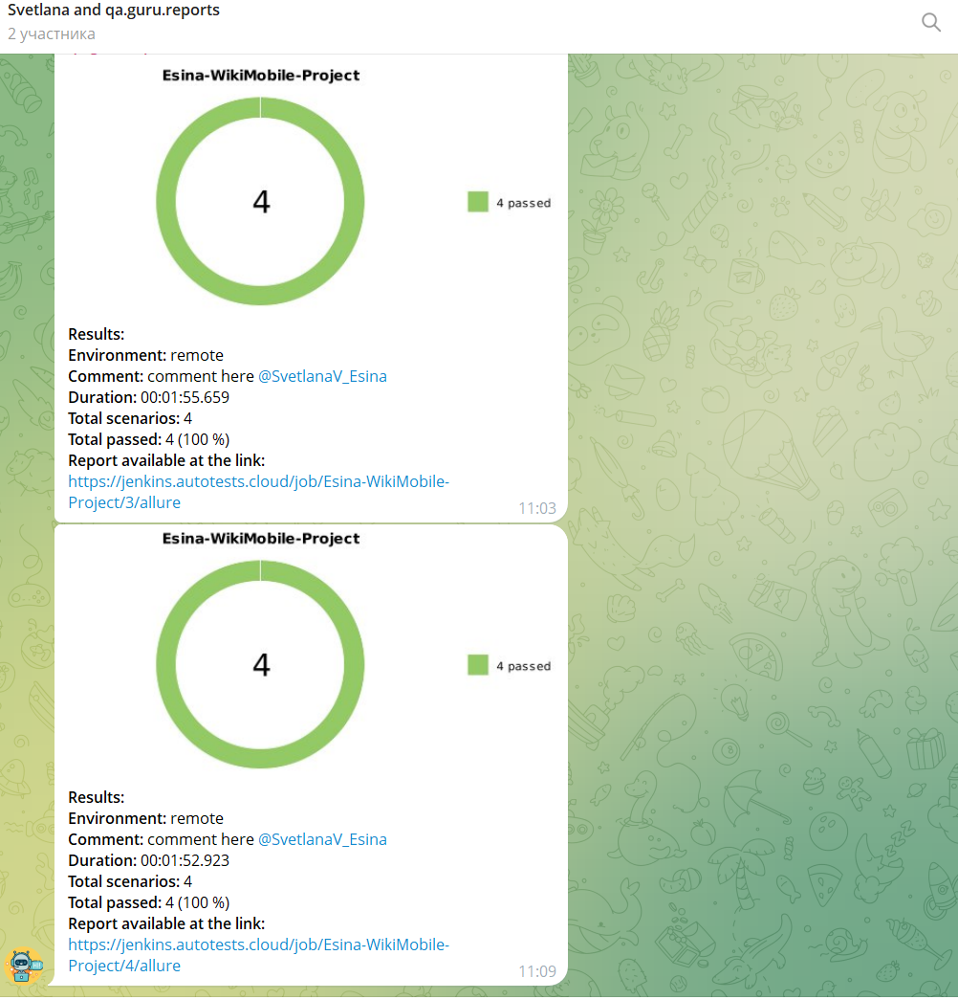

<p align="center">
  
</p>

<h1 align="center">Демо-проект по автоматизации тестовых сценариев для сайта <a href="https://www.wikipedia.org/" target="_blank">Wikipedia</a> 
</h1>

---
## :clipboard: Содержание:

- [Технологии и инструменты](#технологии-и-инструменты)
- [Сборка в Jenkins](#сборка-в-jenkins)
- [Allure-отчет](#allure-отчет)
    - [Overview](#overview)
    - [Детализаци отчета](#детализация-отчета)
- [Видео выполнения автотеста](#видео-выполнения-автотеста)
- [Интеграция с Allure TestOps](#интеграция-с-allure-testops)
    - [Дашборд](#дашборд)
    - [Тест-кейсы](#тест-кейсы)
- [Интеграция с Jira](#интеграция-с-jira)
- [Уведомление в Telegram](#уведомление-в-telegram)

---

## **Технологии и инструменты:**

<p align="center">
    <a href="https://www.jetbrains.com/ru-ru/idea/">
        </a>
    <a href="https://gradle.org/">
        </a>
    <a href="https://www.java.com/ru/">
        </a>
    <a href="https://ru.selenide.org/">
        </a>
    <a href="https://junit.org/">
        </a>
    <a href="https://github.com/">
        </a>
    <a href="https://aerokube.com/selenoid/">
        </a>
    <a href="https://allurereport.org/">
        </a>
    <a href="https://qameta.io/">
        </a>
    <a href="https://www.jenkins.io/">
        </a>
    <a href="https://telegram.org/">
        </a>
    <a href="https://www.atlassian.com/software/jira">
        </a>
    <a href="https://developer.android.com">
        </a>
    <a href="https://developer.android.com/studio">
        </a>
    <a href="https://appium.io">
        </a>
    <a href="https://appium.io/docs/en/latest/quickstart/install/">
        </a>
    <a href="https://www.browserstack.com">
        </a>
</p>

- В данном проекте представлены автоматизированные мобильный тесты, разработанные на языке <code>Java</code> с использованием фреймворка <code>Selenide</code>.
- В качестве сборщика использован <code>Gradle</code>.
- В качестве фреймворка модульного тестирования использован <code>JUnit 5</code>.
- Использована технология <code>Owner</code> для упрощения работы с файлами конфигурации.
- Для удаленного запуска тестов реализована джоба в [Jenkins](https://www.jenkins.io/).
- Для разработки тестов использованы следующие технологии:
- - Локально: Android Studio, Appium Server и Appium ([инструкция](https://autotest.how/appium-setup-for-local-android-tutorial-md)).
- - Удалённо: облачная платформа [Browserstack](https://app-automate.browserstack.com/dashboard/v2/quick-start/setup-browserstack-sdk).
- Реализовано формирование [Allure-отчета](https://jenkins.autotests.cloud/view/java_students/job/SvetlanaV_Esina-Jenkins_first-project/26/allure/) с отправкой результатов прогона тестов в <code>Telegram</code> при помощи бота.
- В проекте так же задействована интеграция с [Allure TestOps](https://qameta.io/) и [Jira](https://www.atlassian.com/software/jira).

## Запуск автотестов

### Локальный запуск тестов из терминала

Локальный запуск на эмуляторе Android Studio:
```bash 
 gradle clean local_test -Dtag=local
```
> Для запуска локальных тестов на компьютере должны быть установлены Android Studio, Appium Server и Appium ([инструкция](https://autotest.how/appium-setup-for-local-android-tutorial-md))

Удалённые запуск на Browserstack:
```bash 
 gradle clean remote_test -Dtag=remote
```
### Удалённый запуск осуществляется через Jenkins

При удалённом запуске тесты запускаются на облачной платформе Browserstack.
При необходимости реализована возможность переопределить параметры запуска

```bash
clean
remote_test
-DdeviceName="$Device_Name"
-Dos_version="$Platform_Version"
-Dtag="$Tag_Build"
```

### Параметры сборки

- <code>Tag_Build</code> – запуск платформы, на которой будут выполняться тесты (local, browserstack).
- <code>Device_Name</code> — модель устройства, на котором будет выполняться тест.
- <code>Platform_Version</code>— версия операционной системы на целевом устройстве.

---

## Отслеживание удаленного запуска тестов в Browserstack



---

## **Сборка в Jenkins:**


>Запуск сборки осуществляется через раздел `Build with Parameters` путём нажатия кнопки `Build`



---

## **Allure-отчет:**
### Overview

> Главная страница отчета, которая содержит общую информацию о прохождении тестов:
- <code>ALLURE REPORT</code>: Содержит дату и время прохождения тестов, общее количество кейсов и диаграмму с распределением успешных (passed), упавших (failed) и сломавшихся (broken) тестов.
- <code>TREND</code>: Показывает историю прохождения тестов от сборки к сборке.
- <code>SUITES</code>: Распределение результатов тестов по тестовым наборам (пакетам).
- <code>ENVIRONMENT</code>: Информация о тестовом окружении, на котором запускались тесты (версия браузера, ОС, URL стенда и т.д.).


### Детализация отчета
> Для детального анализа прохождения тестов используется раздел Suites, где тесты отображаются в виде иерархического дерева, что помогает лучше ориентироваться в результатах.


---

## **Видео выполнения автотеста:**
> К каждому тесту в отчете прилагается видео:

https://github.com/user-attachments/assets/3c34f7a2-81ba-446e-8e60-e9fa87ea6d01

---

## **Интеграция с Allure TestOps:**
### Дашборд
> Результат и статистика выполнения автотестов отображается в разделе Dashboard.



### Тест-кейсы
> В разеделе Тест-кейсы представлен список автоматизированных и ручных тестов, реализованных в рамках проекта



### Запуски
>В разеделе Запуски имеется возможность детального просмотра и анализа прогона тестов



---

## **Интеграция с Jira:**

> Реализована интеграция Allure TestOps с Jira. В задаче отображен список связанных тестов и результаты их прогонов.





---

## **Уведомление в Telegram:**
> По завершению сборки в чат Telegram автоматически направляется уведомление с результатом прогона тестов.
> Из уведомления возможен переход в Allure Report по указанной ссылке.


